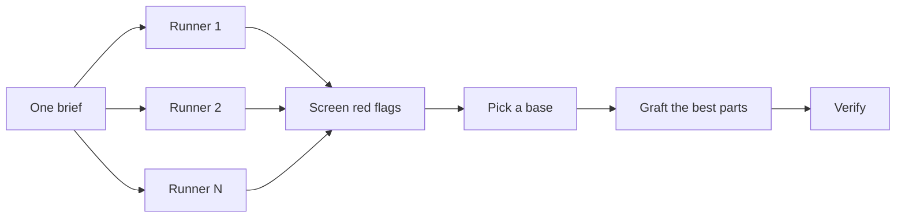

# Design before you write code

One attempt at a hard design locks in the first shape the model thought of. `architect`
settles types and boundaries before implementation by having independent runners sketch
competing designs and synthesizing the best one. `interrogate` has independent reviewers try
to break the result. `swarm` covers slices or races when the job is coverage, not synthesis.

Runners and reviewers use the current host's model and nothing else: opus on Claude Code,
Luna (`gpt-6-luna`) on Codex. There is no per-reviewer model list to maintain.

## Settle the shape with `architect`

```text
/vistack:architect design the import pipeline before writing any code. I care most about
how callers use it.
```

On Codex, use `$vistack:architect`. [`architect`](../../skills/architect/SKILL.md) grounds
itself first: an `analyst` impact map over the code the design touches, plus a history pass
when the design moves ownership or layers. Then independent runners each produce a design
package — the caller's usage first, then types, signatures, and a module map. The skill
screens every candidate against the [design red flags](../../skills/architect/references/design-red-flags.md),
picks a base, grafts the best parts of the others, and writes the
[rationale](../../skills/architect/references/rationale-template.md).

By default it continues from the synthesized design into implementation. To see the design
first, say so:

```text
/vistack:architect with checkpoint. Stop and show me before implementing.
```

### How the candidates are compared



The default is two structurally distinct candidates. Ask for more when the decision is
expensive to reverse:

```text
/vistack:architect this, 3 candidates. The cache key format is expensive to change later.
```

The lead reads every candidate end to end before picking. A read-only judge scores them
against the brief's rubric in parallel; because the judge shares the runners' model family,
its verdict is an input to the pick, not the pick.

## Cover slices and races with `swarm`

```text
/vistack:swarm check every package under packages/ against its test command. One lane per
package. One report.
```

[`swarm`](../../skills/swarm/SKILL.md) fans lanes across independent slices, coverage
matrices, or declared race arms, and returns `PASS`, `ISSUES`, or `BLOCKED` per lane. Use it
when parallelism buys coverage. Use `architect` when every runner should attempt the same
design and the best parts should be merged.

## Break it with `interrogate`

```text
/vistack:interrogate the whole branch, skeptically. No nitpicks unless it is a real bug or
regression.
```

[`interrogate`](../../skills/interrogate/SKILL.md) sends the same diff, intent, rubric, and
code-quality lens to several independent reviewers. The lead sorts every finding into
`Act on`, `Consider`, `Noted`, and `Dismissed`, gives a reason for each dismissal, and applies
nothing. Read the dismissals too: the lead is a pragmatic senior engineer, not an oracle, and
you can overrule it.

The reviewers share one model family, so a finding several of them raise is strong signal,
and silence is weak signal. An empty review does not prove the change works; the QA contract
and the health check still decide that.

## How much design does a task deserve?

Most changes need none of this.

| Change | Use |
|---|---|
| A small, finished change you are unsure about | `interrogate` |
| A change that crosses function boundaries or moves ownership | `architect` |
| A standalone decision where independent attempts help — naming, a format, an algorithm | `architect` with a one-file brief |
| A coverage matrix, parallel checks, or a race with declared arms | `swarm` |
| A contested design that is expensive to reverse | `architect`, then `interrogate` before done |

The `feature`, `refactor`, and `multi-phase-plan` playbooks already apply this ladder: a
boundary-crossing change runs `architect` at its architecture step. Reach for the skills
directly when you want more or less scrutiny than the default.

These are separate from the advisor. The advisor reads the whole session and speaks at three
moments (`skills/advisor/SKILL.md`). `architect` and `interrogate` are deliberate passes you
or the playbook ask for; neither replaces the other.

## Hosts

| | Claude Code | Codex | OpenCode |
|---|---|---|---|
| Invoke | `/vistack:architect`, `/vistack:interrogate` | `$vistack:architect`, `$vistack:interrogate` | ask for the skill by name |
| Runners and reviewers | `design-runner` and `reviewer` agents on opus, dispatched in parallel | separate `codex exec --ephemeral -m gpt-6-luna` processes; reviewers in a read-only sandbox | the current model, one at a time in the thread |
| Independence | fresh context per agent | fresh process per runner or reviewer | reduced — recorded in the ledger |

Credit: the design ladder, the red flags, and the review framework are adapted from the
pstack plugin's design guide and its `architect` and `interrogate` skills.
