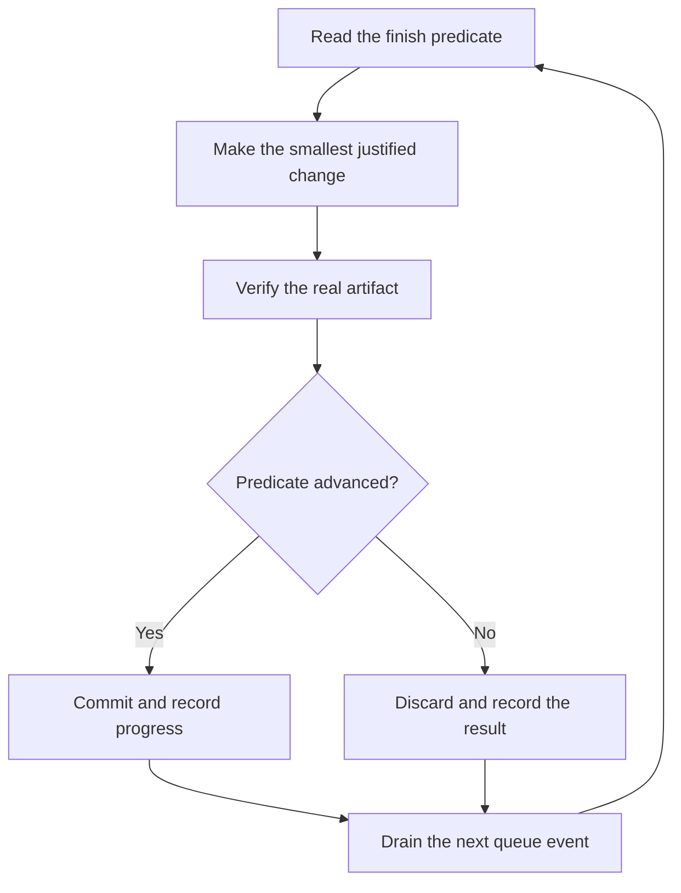

# Run work while you sleep

An overnight run is safe only when the next agent can answer four questions without the
human. What is the goal? What proves it is done? What may it change? When must it stop?

## The overnight handoff

```text
/vistack I am going to bed. Migrate every caller to the new parser in a fresh worktree.
Done means zero old callers, all parser fixtures pass, and the old API is deleted.
Keep parser output unchanged. Commit and push slice branches, but do not merge.
Keep the decision ledger. If the blocker loop is exhausted, stop and write the dossier.
```

The goal gives the run its scope. The finish predicate lets every iteration decide whether
it advanced. The permission line lets reversible work continue without a confirmation. The
withheld action protects the merge boundary. The escape hatch prevents creative goal changes
after a dead end.

## What the loop does



Each iteration has one change, one check, and one ledger row. A change that does not help is
discarded. A plateau changes the approach, not the finish predicate. A stalled lane is
reconciled and routed to `blocker`, not left waiting for a completion notification.

## State and wake mechanisms

The run writes state and its ledger before dispatch. Claude Code uses `.claude/state/` and
`/loop 10m /vistack babysit <slug>`. Codex uses `.codex/vistack/state/` and the host's
recurring-task or background equivalent when available. A persisted `active` monitor flag is
not proof of a live process. The coordinator records its owner and verifies the wake
mechanism after every pickup.

One monitor owns the run. A second monitor is not a recovery strategy. Reconcile state,
branches, worktrees, PRs, and agent status first.

## The morning audit

Run `show-me-your-work` or read the state and ledger directly. Check every row against a real
action, every evidence pointer against a file, URL, SHA, command output, or artifact, and
every important pivot or discarded attempt against the trail. Read the Attention section
first, then inspect the rows it names.

The result is merge-ready draft PRs, not merged code. Merging, deployment, data deletion,
secret changes, and other irreversible actions remain human-owned fences.
