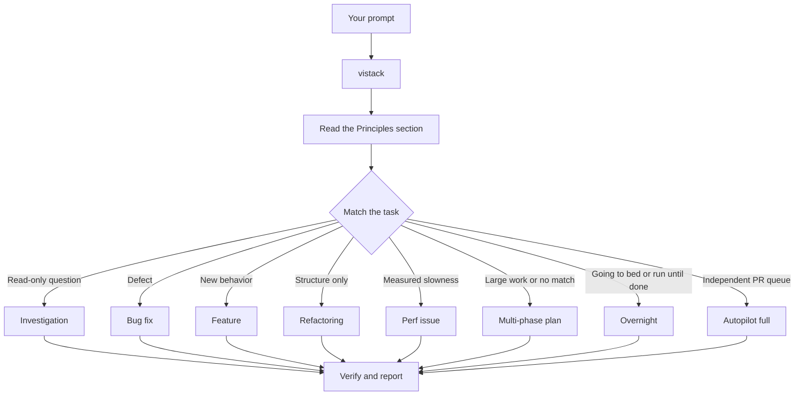

# Using viStack

One command. The request shape is what makes it work.

```
/vistack <what you observed or want>. Done means <checkable condition>.
Keep <behaviour that must not change>.
```

Three parts, and each one does a job:

| Part | What it decides |
|---|---|
| what you observed or want | which playbook matches |
| `Done means …` | when the run stops, and what the health check measures against |
| `Keep …` | what a regression is, so the QA scenarios have something to protect |

Leave out the finish condition and viStack will ask for it before starting an autonomous
run. That is the one question it blocks on, because everything after is measured against it.

For a run you will review later, include the permission boundary and escape hatch:

```text
/vistack I am going to bed. Migrate every caller to the new parser in an isolated worktree.
Done means zero old callers, all parser fixtures pass, and the old API is deleted.
Keep parser output unchanged. Commit and push branches, but do not merge.
If the blocker loop cannot resolve a problem, stop with the full attempt dossier.
```

That request matches `overnight`. The run checks the predicate, makes one evidence-backed
change, verifies it, records one ledger row, and repeats. It stops at merge-ready drafts or
one of the four fences.

## Sticky mode

Once `/vistack` has run, the session is in viStack mode.

- **Follow-up turns stay in the mode.** Answer a question, add a constraint, ask for a
  change — it continues the open playbook at its next unchecked step. No re-invocation.
- **`new task` forces a fresh playbook match.** It discards the open playbook and starts at
  the principles index again.
- **A request for a report or chart mid-run** renders it and returns to the open
  playbook at the step it was on. The run does not re-match.
- **`stop` or `pause`** runs `pause-safely`: commits and pushes every worktree, releases
  shared claims, writes the final state, and hands back the resume command.
- A completed playbook does not exit the mode. It leaves it idle, waiting for `new task`.

## What happens after you send it

1. The principles index is read. Always first, always unconditionally.
2. One playbook is matched, and its steps are copied into the task list **verbatim** — not
   paraphrased, not reordered, not merged. A step that will not be run stays visible and
   marked skipped, with the reason in the ledger.
3. The finish condition is stated in checkable terms.
4. Work is sliced, a conflict matrix decides what runs in parallel, and one agent per slice
   runs in its own worktree.
5. Each finished slice raises its draft PR immediately.
6. QA runs against each PR's own preview. A pass needs a screenshot, and every browser
   scenario is also recorded as a video tied to its assertion points.
7. A Haiku health check audits each diff against the acceptance criteria.
8. It stops at merge-ready. **It never merges.**

Between phase boundaries it runs. No confirmations, no progress narration, no status
questions — except at the four fences.

## What happens to your prompt



The diagram shows the common routes. The full route set includes intake, design
implementation, blocker recovery, PR stacks, QA verification, session pickup, safe pause,
babysitting, worktree cleanup, skill authoring, agent design, preference capture, and
`html-report`.

## Reports and pages

Ask for the page you want and viStack renders it:

```text
/vistack make an HTML timeline of the login incident
/vistack show the auth architecture as a diagram
```

What comes back is one self-contained HTML page at `<state-root>/reports/`, plus a private
Claude artifact link on Claude Code. A run with more than one slice, or any unattended run,
ends with a run report the same way, so the first thing to open after an overnight run is a
page, not the ledger. "Explain how X works" stays `investigation`; its answer may also render
as a page. The contract is `skills/html-report/SKILL.md`.

## The four fences

Control comes back to you in exactly these cases, and nowhere else:

1. A blocker unresolved after the loop — arrives as a dossier, not a question.
2. Ambiguity that changes acceptance criteria or a public contract.
3. An irreversible action: force-push to a shared branch, history rewrite, shared-env
   migration, secret rotation, production deploy, dependency major bump, merging anything.
4. Credentials missing, expired, or about to be written to a tracked file.

## Where a run's state lives

| Thing | Path |
|---|---|
| State file | Claude `.claude/state/<slug>.json`; Codex `.codex/vistack/state/<slug>.json` |
| Decision ledger | The matching state root with `.tsv` extension |
| Worktrees, one per slice | Claude `.claude/worktrees/<slug>-<slice>`; Codex `.codex/vistack/worktrees/<slug>-<slice>` |
| Live agent sessions | the `Engineering work — agent sessions` comment on the issue |

## Resuming

Session still alive → attach through the host's coordinator session operation, using the
resume id in the session record.

Session gone → `/vistack session-pickup <slug>`. It reads the state file and the ledger,
reconciles them against `git worktree list`, `git branch -a`, and `gh pr view`, writes down
every divergence, and resumes at the earliest unfinished phase.

## Invoking a principle

Any indexed principle is invocable by name. A reply that invokes one must name **the
decision the principle changed**. Restating the name is not invoking it. See
`skills/vistack/principles/index.md`.

## Related

- Mistakes that cost the most: `common-mistakes.md`
- Ledger column semantics: `ledger-format.md`
- Overnight handoff: `overnight.md`
- How much design a change deserves: `design.md`
