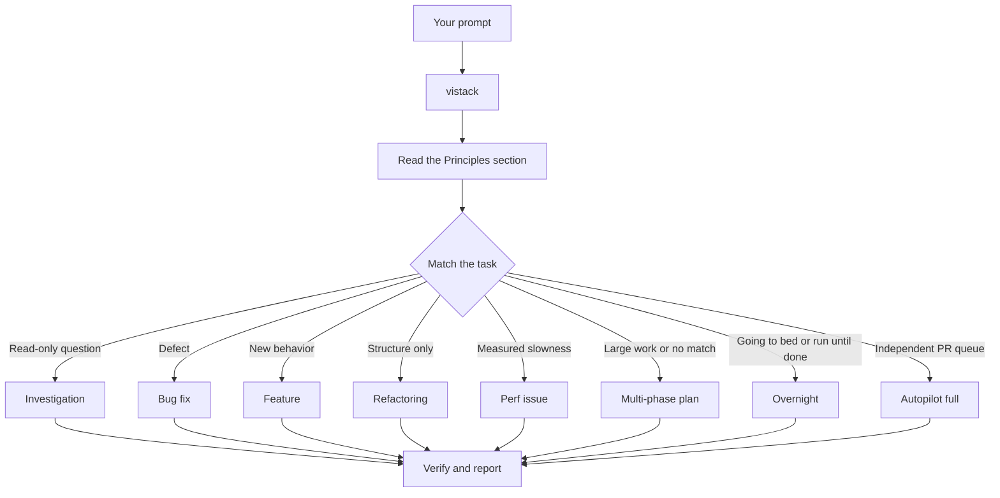

# viStack

The router chooses the contract. The playbook owns the steps. The coordinator owns state,
dispatch, and evidence. The owning role does the work.

`vistack` is the identifier. `viStack` is the name used in prose. Every path in this plugin
is relative to its root.

## What happens to your prompt

The diagram shows the common routes. The full route set includes intake, design
implementation, blocker recovery, PR stacks, QA verification, session pickup, safe pause,
babysitting, worktree cleanup, skill authoring, and preference capture.

## Human-facing communication

Write external text as the responsible project participant. Do not mention viStack, a
skill, an agent, a model, or a host in issue text, PR text, review feedback, or QA results.
Describe the work, evidence, decisions, and next steps in the project's ordinary voice.
Internal state may retain role and execution metadata.

## Host adapter

Detect the host from the available plugin surface before running a playbook.

Claude Code uses `commands/vistack.md`, Claude agents, `.claude/state/`, and
`.claude/worktrees/`. Its default monitor is `/loop 10m /vistack babysit <slug>`.

Codex uses this skill in the current thread, adopts the named roles sequentially, and uses
`.codex/vistack/state/` and `.codex/vistack/worktrees/`. Use the host's recurring-task or
background equivalent for a monitor when available. If the host cannot keep a process alive
after the thread ends, record that limitation and leave a resumable state file. Never claim
that an overnight monitor is active without a live owner and wake mechanism.

Claude-only steps remain in the task list when running on Codex. Mark them skipped in the
ledger with the host-specific reason. In particular, do not run `/loop`, `claude attach`,
Claude issue-comment upserts, or Claude-only agent declarations in Codex. Continue the
equivalent phase in the current thread unless a real fence is reached.

The state root and worktree root are selected once per run. Never mix Claude and Codex roots.
A run resumes on the host that created it.

## Step 0. Sticky mode

Once this skill starts, every later turn stays inside the open playbook.

| User input | Action |
|---|---|
| `babysit <slug>` or a monitor wake | Run one babysit pass, then return to the open playbook. Do not re-match. |
| Any other mid-run input | Continue the next unchecked playbook step. |
| `new task` | Close the current run if safe, then return to the principles index and match again. |
| A second unrelated request | Finish or run `pause-safely`, then wait for `new task`. |
| `stop` or `pause` | Run `pause-safely`. |
| `going to bed`, `run until done`, or `don't stop` | Enter `overnight` and keep going through reversible work. |

Leaving the mode is the user's call. A completed playbook leaves the mode idle and waiting
for `new task`.

## Step 1. Read the principles index

Before matching, read `skills/vistack/principles/index.md` in full. Add this literal first
task-list item:

> 1. Read `skills/vistack/principles/index.md`.

Read the leaf skill for every principle that changes a decision. In the final report, name
the decision it changed. Naming a principle without naming its effect is not a citation.

## Step 2. Match exactly one playbook

Add a second task-list item for the match, then copy every numbered step from the selected
playbook into the task list verbatim.

Verbatim means no paraphrase, reorder, merge, or silent omission. A skipped step remains in
the task list with `skip: <reason>`, and the reason gets a `step-skipped` ledger row.

| Playbook | Match when |
|---|---|
| `intake` | The request is raw or its ticket has not passed readiness. |
| `investigation` | The user wants understanding or a recommendation and no code change. |
| `feature` | New behavior has specified acceptance criteria. |
| `bug-fix` | Wrong behavior is reported and needs reproduction and correction. |
| `refactor` | Structure must change while observable behavior stays the same. |
| `design-implementation` | Figma is the source of truth. |
| `perf-issue` | A measured performance problem needs one evidence-backed fix. |
| `prototype` | A quick experiment can settle an empirical or design question. |
| `blocker` | An open unit is stuck on one identified obstacle. |
| `pr-stack` | A finished branch needs one PR or a parent-to-child chain. |
| `qa-verification` | A PR needs behavioral evidence from its own live environment. |
| `autopilot-stack` | A groomed ticket should run unattended and stop at a reviewed stack. |
| `autopilot-full` | Independent PRs should run in parallel to merge-ready drafts. |
| `overnight` | The user is stepping away and names a finish predicate and escape hatch. |
| `multi-phase-plan` | Work is large, cross-cutting, or has no existing route. |
| `session-pickup` | A prior run must be reconstructed from state, a ledger, or a branch. |
| `pause-safely` | Work must stop while remaining resumable. |
| `babysit` | A dispatched run or PR set needs a status and recovery pass. |
| `worktree-cleanup` | Stale worktrees need an evidence-based cleanup audit. |
| `authoring-skill` | A SKILL.md or a workflow contract is being created or changed. |
| `automate-me` | The user wants working preferences captured in a reusable mode skill. |

Ties break toward the most specific route. A groomed ticket with no other signal is
`autopilot-stack`. A large run the user will review later is `overnight` when the request
includes a sleep or step-away handoff. A program that needs a standing coordinator across
many days is `multi-phase-plan`; it must still state its size and finish predicate.

## Step 3. State the finish condition

Add a third task-list item with a checkable predicate.

> Done means: `<command, screen, count, or named artifact that settles it>`. Unchanged: `<behavior that must not change>`.

Use the ticket's acceptance criteria when they exist. If no predicate can be derived,
stop at FENCE 2. Do not start an unattended run on "works", "fixed", or "better".

An overnight handoff also records:

- the exact permissions granted, such as committing and pushing slice branches;
- the exact permissions withheld, such as merging or production writes;
- the escape hatch, such as a blocker dossier after the bounded loop;
- the wake mechanism and the time or side-effect rule that identifies a stalled lane.

## Step 4. Choose the role contract

Roles carry their model in agent frontmatter. Do not override it per run. Use the role whose
uncertainty matches the work.

| Work | Role |
|---|---|
| Judgment, decomposition, prose, ambiguity, and review decisions | `opus` roles |
| Precisely specified implementation and QA driving | `sonnet` roles |
| Mechanical work and adversarial acceptance checks | `haiku` roles |

Every brief is standalone. It names the goal, writable files, forbidden files, context
references, acceptance checks, verification commands, timebox, and report shape. A missing
field is a scoping defect. Complete the brief before dispatching.

## Step 5. Dispatch and drain

Enter `skills/coordinate/SKILL.md` and follow it.

The coordinator owns the state file, ledger, monitor, worktree allocation, and phase
transitions. It never edits product code. One slice uses one worktree and one owner. Shared
files serialize according to the conflict matrix. Disjoint slices run in parallel.

Treat completions as queue events. Drain the report, verify its evidence, update state then
ledger then the session comment, and dispatch the next eligible unit. Do not wait for a human
between reversible phases.

Count commits, pushes, check deltas, captured artifacts, and reports as progress. A lane
that reaches its expected runtime with no side effect is stalled. Route it to `unblock` or
replace it according to the playbook. Do not let a polite completion notification become the
only wake mechanism.

## The four fences

Return control to the user only in these cases.

1. A blocker remains after `unblock` has exhausted its bounded attempts or aborted on
   repeated evidence.
2. Two interpretations change acceptance criteria or a public contract.
3. An irreversible action is next, including merge, force-push to a shared branch, history
   rewrite, production deploy, shared-environment migration, secret rotation, data deletion,
   or a dependency major bump.
4. Credentials are missing, expired, or about to be written to a tracked file.

FENCE 1 returns the full attempt dossier. FENCE 2 returns the competing readings and their
   consequences. FENCE 3 names the exact action and target. FENCE 4 names the missing
   credential path without exposing secret contents.

Outside the fences, do not ask for confirmation or narrate progress. Fix reversible drift,
review noise, broken skills, and tooling failures in scope. Put unrelated fixes in a
separate PR and return to the original predicate.

## Merge boundary

viStack stops at merge-ready. Every PR stays a draft. A clean QA result and health check are
not merge authority. Merging is FENCE 3 and belongs to the human.

## Reuse existing skills

viStack supplies routing, coordination, run state, the conflict matrix, and the ledger.
Invoke existing project skills for ticket work, PR creation, review assignment, QA, comment
cleanup, and worktree cleanup. Do not write a second implementation of those capabilities.

## Final report

Report at phase boundaries only. State what changed, the evidence, what is next, and any
open fence. For overnight or other long runs, include the decision-trail path, iterations,
progress side effects, discarded attempts, final predicate state, and a short Attention
section for anything the human should inspect first.
